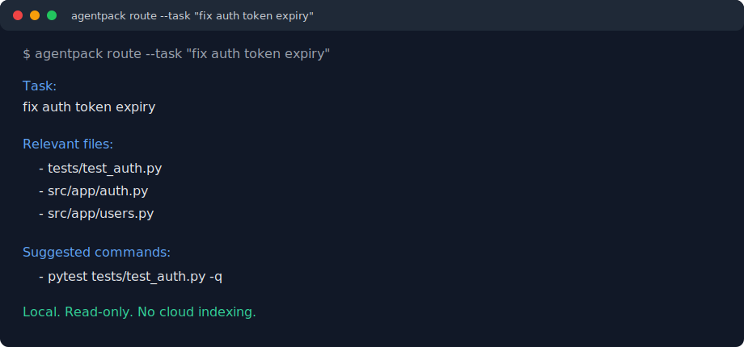

# AgentPack

[](https://pypi.org/project/agentpack-cli/)
[](https://pepy.tech/projects/agentpack-cli)
[](https://www.npmjs.com/package/@vishal2612200/agentpack)
[](https://www.npmjs.com/package/@vishal2612200/agentpack)
[](https://pypi.org/project/agentpack-cli/)
[](https://opensource.org/licenses/MIT)
[](https://github.com/vishal2612200/agentpack/actions/workflows/ci.yml)

**Local context engine for AI coding agents.**

AgentPack ranks relevant repository files and builds compact task-focused context packs for Claude Code, Codex, Cursor, Windsurf, Antigravity, MCP tools, CI jobs, and markdown-based LLM workflows.

It runs local/offline repo analysis, compresses selected files into a token budget, and keeps context fresh through CLI commands, MCP tools, hooks, and agent integrations. Use it when an AI coding agent needs a ranked starting map instead of burning tool calls rediscovering your repo.

AgentPack is a context preparation tool, not a coding agent.

One workflow matters:

```text
route -> pack -> agent acts -> benchmark captures miss
```

First route the task to likely files, tests, rules, and skills:

```bash
pipx run --spec agentpack-cli agentpack route --task "fix auth token expiry"
```



> **Status: alpha (v0.3.22).** Works, tested, and used in real sessions. Python and JavaScript/TypeScript are the best-supported languages. Current benchmarks are useful regression checks, not broad proof that AgentPack improves coding-agent success. API may change before 1.0.
>
> **Platform note:** macOS, Linux, and Windows are supported. Windows support targets PowerShell plus Git for Windows. `cmd.exe` and bare Git setups are not a supported path yet.
>
> **Name note:** PyPI package is `agentpack-cli`, npm package is `@vishal2612200/agentpack`, and the command is `agentpack`. This project is unrelated to AgentPack dataset papers or other repos with the same name.

## What's New in 0.3.22

`0.3.22` is a benchmark recall release. It promotes maintenance-context
recovery to the current expanded public-suite baseline: **66.0% recall / 51.1%
token precision** across 108 scored public cases.
`0.3.21` established the prior honest baseline at **57.0% recall / 50.6% token precision**. The new result clears the 65% recall target while keeping token
precision above the 51% release floor; remaining risk is config/build recall and NestJS token precision. Result: [`benchmarks/results/2026-06-13-public.md`](benchmarks/results/2026-06-13-public.md).

## Core Workflow

### 1. Route

Use the read-only router when you want quick orientation without writing files:

```bash
agentpack route --task "fix auth token expiry"
```

### 2. Pack

```bash
agentpack task set "fix auth token expiry"
agentpack pack --task auto
```

AgentPack writes `.agentpack/context.md` with selected files, omitted-file
receipts, task freshness, token stats, and suggested checks.

### 3. Agent Acts

Point the agent at the pack or use MCP tools. Agent still verifies code before
editing; AgentPack is map, not correctness proof.

### 4. Benchmark Captures Miss

After a task, capture the files that actually changed:

```bash
agentpack benchmark capture --since main --task "fix auth token expiry"
agentpack benchmark --misses
```

Miss diagnostics show whether a required file was ignored, scored too low,
ranked but cut by budget, or absent from scan.

## Features

- **Route**: read-only task map with relevant files, tests, rules, skills, commands, and warnings.
- **Pack**: budgeted context with `full`, `diff`, `symbols`, `skeleton`, or `summary` file views.
- **Act**: CLI, markdown, MCP, and agent integrations for Claude Code, Codex, Cursor, Windsurf, Antigravity, and generic agents.
- **Benchmark**: expected-file recall, token precision, miss diagnostics, public commit suites, and E2E A/B reports.
- **Local**: no cloud indexing, embeddings, or API calls for scan, summarize, rank, pack, stats, or benchmark.

## Benchmark Proof

Current local release-candidate table: expanded public-suite historical commits
across Python, TypeScript, Go, Java, and monorepo repos, scored against files
actually changed by each commit.

| Metric | Result |
|---|---:|
| Scored cases | 108 |
| Avg recall | 66.0% |
| Avg token precision | 51.1% |
| Pack p50 | 315 tokens |
| Pack p95 | 1,150 tokens |

Full local table: [`benchmarks/results/2026-06-13-public.md`](benchmarks/results/2026-06-13-public.md). This is scoped benchmark evidence, not a universal quality claim.
The latest published v0.3.20 table remains available at
[`benchmarks/results/2026-06-11-public.md`](benchmarks/results/2026-06-11-public.md).
Reproduce the expanded public suite:

```bash
agentpack benchmark --public-suite --reproduce v0.3.20
```

Benchmark methodology lives under [`benchmarks/results/v0.3.20/`](benchmarks/results/v0.3.20/methodology.md).

### Release Benchmark Gate

The current local release-candidate result clears the target: **66.0% recall**
and **51.1% token precision**. The target should continue to be measured on the
same 100+ public historical-commit suite, with per-language slices published so
aggregate gains are not hiding TypeScript, Go, Java, or monorepo regressions.

Decision gate for the next public table:

- full-suite recall is at least 65.0%
- full-suite token precision is at least 51.0%
- no major language or task slice loses more than 2 recall points
- Vite/TypeScript, Gin/Go, Click/Python, and NestJS monorepo misses are reported separately
- any AgentPack-vs-no-AgentPack A/B claim includes task success, tool calls,
  token cost, and time-to-first-correct-file

## Trust

AgentPack is MIT licensed, local-first, and uses PyPI Trusted Publishing plus
npm provenance for release artifacts. See [`SECURITY.md`](SECURITY.md),
[`docs/privacy.md`](docs/privacy.md), [`docs/threat-model.md`](docs/threat-model.md),
and [`docs/data-flow.md`](docs/data-flow.md).

## Use Cases

Start with the [docs index](docs/index.md), or jump to guides for
[Claude Code](docs/claude-code-context-engine.md), [MCP](docs/mcp-context-engine.md),
[Cursor](docs/cursor-context-packing.md), [token usage](docs/reduce-claude-code-token-usage.md),
[AI coding agent context](docs/ai-coding-agent-context.md), and [how AgentPack works](docs/how-agentpack-works.md).

## Install

```bash
pipx install agentpack-cli
agentpack --version
```

Requires Python 3.10+ and is tested on Python 3.10-3.14. The PyPI package is `agentpack-cli`; the command is `agentpack`. Use `pipx` for normal installs because many macOS/Linux Python distributions block global `pip install` with PEP 668's `externally-managed-environment` error. If you prefer `pip`, install inside a virtual environment.

Install `pipx` first if needed:

```bash
# macOS
brew install pipx

# Ubuntu/Debian
sudo apt install pipx

# Fedora
sudo dnf install pipx

# Arch
sudo pacman -S python-pipx

pipx ensurepath
```

For JavaScript/TypeScript projects you can use the npm wrapper:

```bash
npx @vishal2612200/agentpack --version
npx @vishal2612200/agentpack init --yes
npx @vishal2612200/agentpack pack
```

## Quickstart

```bash
cd your-repo
agentpack init --yes
agentpack work "fix auth token expiry"
```

Then read `.agentpack/context.md` or the agent-specific context file listed in the output. AgentPack also integrates with MCP so agents can call tools directly instead of reading markdown artifacts.

A good explicit workflow is:

```bash
agentpack task set "fix billing webhook retry handling in app/api/billing/route.ts" --guard
agentpack next --fix-all-safe
agentpack status
agentpack finish --since main
```

Use `agentpack quickstart --task "..." --write` when you want AgentPack to print the next commands and write the task file for you. Use `agentpack start "..." --pack-only` when you want only a fresh pack and not the guard path.

### Learn from AI-assisted work

Generate local post-task learning artifacts from `.agentpack/task.md` and git changes:

```bash
agentpack learn
agentpack learn --today
agentpack learn --since main
agentpack learn --json
agentpack learn --llm-prompt --pr-comment
agentpack learn --provider-preview
agentpack learn --provider-command "python scripts/learn_provider.py"
agentpack learn --dashboard --team-export
agentpack learn --skills
agentpack learn --drills
agentpack learn --ci
agentpack learn --feedback helpful --feedback-target "skill:CLI design" --feedback-note "Useful review prompts"
```

AgentPack writes developer notes to `.agentpack/learning.md` or `.agentpack/daily-summary.md`, updates a local skill memory in `.agentpack/skills-progress.json`, writes ranked `.agentpack/agent-lessons.md` for future coding agents, and can emit `.agentpack/learning.prompt.md`, `.agentpack/pr-learning-comment.md`, `.agentpack/learning-dashboard.html`, or `.agentpack/team-lessons.md`. Learn is local-first by default: `--provider-preview` shows the bounded payload for optional external refinement without making a network call, `--provider-command` runs only the local command you provide, and feedback stays in `.agentpack/learning-feedback.jsonl`.

Use `--dashboard` when a developer wants an IDE-friendly review surface. Use
`--team-export` when the useful lesson should be shared without publishing a
personal skill history. Use `--ci` to fail a workflow when the generated
learning is too generic or lacks changed-file evidence.

## Agent Setup

AgentPack can install repo-local instructions and hooks for the coding agent you use. The installer is idempotent and merges with existing config where possible.

```bash
agentpack init --agent claude
agentpack init --agent codex
agentpack init --agent cursor
agentpack init --agent windsurf
agentpack init --agent antigravity
agentpack init --agent generic
```

What each integration writes:

| Agent | Files |
|---|---|
| Claude Code | `CLAUDE.md`, `.claude/settings.json`, `.mcp.json` |
| Codex | `AGENTS.md`, `.codex/hooks.json`, git hooks |
| Cursor | `.cursorrules`, `.cursor/rules/agentpack.mdc`, `.vscode/tasks.json`, git hooks |
| Windsurf | `.windsurfrules`, `.vscode/tasks.json`, git hooks |
| Antigravity | `GEMINI.md`, `.vscode/tasks.json`, git hooks |
| Generic | no agent-specific files; use `context.md` directly |

MCP-capable agents should prefer AgentPack MCP tools over reading markdown files directly. The markdown context files remain useful for manual review, CI, non-MCP agents, and logs.

Generated instructions keep thread mode explicit. They recommend `AGENTPACK_THREAD_ID=<stable-id> agentpack ... --thread auto` when you want scoped state, but plain installed hooks continue using global `.agentpack/task.md` and `.agentpack/context.md`.

## Configuration Snapshot

`agentpack init` creates `.agentpack/config.toml`. Most projects can use the defaults:

```toml
[context]
default_mode = "balanced"
default_budget = 40000

[context_lite]
budget = 8000

[agents.generic]
output = ".agentpack/context.md"
```

Use `agentpack pack --mode lite` when you want a cheap ranked map before deeper file reads. Use the default `balanced` mode for normal agent work and benchmark claims. Use `deep` when the task needs broader docs and source context.

Use `.agentignore` to remove generated output, vendored code, large exports, or files that repeatedly appear as ranking noise. AgentPack imports obvious generated/noisy entries from gitignore sources during init, but repository-specific outputs should still be added by hand.

Use scoring weights only after measuring a real miss:

```bash
agentpack benchmark --misses
agentpack explain --file path/to/missed_file.py
agentpack diagnose-selection
agentpack ignore suggest
```

Configuration detail: [`docs/configuration.md`](docs/configuration.md).

## Common Workflows

### Debug Selection

```bash
agentpack explain --task auto
agentpack explain --file src/auth/session.py
agentpack explain --omitted
agentpack stats
agentpack diagnose-selection
```

### MCP-First Agent Flow

1. Call `start_task(task)` when a new task begins. AgentPack writes `.agentpack/task.md`, packs context, and returns ranked markdown.
2. Call `get_context()` when you need the latest pack. It blocks for one refresh if `.agentpack/task.md` or the repo snapshot changed since the last pack.
3. Use `route_task(task)` for a lightweight route: relevant files, rules, skills, commands, and safety warnings without writing a full context file.

### Multiple Agent Threads

Plain `agentpack pack`, `agentpack status`, and `agentpack guard` keep legacy global behavior and ignore ambient host thread env vars. Use thread mode only when you explicitly ask for it:

```bash
agentpack pack --thread codex-local
AGENTPACK_THREAD_ID=codex-local agentpack pack --thread auto
agentpack threads --active
agentpack state show --thread codex-local
```

Thread mode writes under `.agentpack/threads/<id>/` and appends `.agentpack/thread_index.jsonl`. Same-worktree, same-branch overlap is warning-only; separate worktrees or branches remain the safest workflow for concurrent edits.

### Release Validation

```bash
agentpack dev-check
agentpack release-check
agentpack verify-wheel
agentpack release prepare
agentpack ci init
```

The Makefile remains maintainer convenience, but the CLI commands above are the
package-user source of truth. `agentpack benchmark --release-gate` runs the
public proof path: public repos, proved target files, misses, and public table
output. `--sample-fixtures` remains a regression smoke path, not the release
gate.

## Commands

| Command | Purpose |
|---|---|
| `agentpack init --yes` | Create local config and ignore files |
| `agentpack work "task"` | Initialize if needed, start task, refresh context, show next steps |
| `agentpack start "task"` | Write task and run the guard/refresh workflow |
| `agentpack finish --since main` | Diagnose, capture benchmark case, run checks, mark done |
| `agentpack learn` | Generate developer learning notes, skill memory, feedback-aware drills, and future-agent lessons |
| `agentpack task show|set|clear` | Manage global or thread-scoped task files |
| `agentpack pack` | Generate a ranked context pack for `.agentpack/task.md` |
| `agentpack next --fix-all-safe` | Ask AgentPack what command or safe repair should happen next |
| `agentpack guard --repair-stale --refresh-context` | Check freshness, repair stale rules, refresh context |
| `agentpack status` | Show context freshness and git/task state |
| `agentpack stats` | Show pack size, token savings, and top files |
| `agentpack dashboard` | Local HTML control plane for context, skills, learning, and benchmark quality |
| `agentpack explain --task auto` | Debug selected and omitted files |
| `agentpack diagnose-selection` | Turn latest pack/benchmark signals into concrete tuning actions |
| `agentpack ignore suggest|apply` | Suggest or apply `.agentignore` improvements |
| `agentpack route --task "..."` | Get lightweight task routing without a full context file |
| `agentpack threads [--active] [--conflicts]` | Inspect thread-scoped context state |
| `agentpack state show|set|done` | Read or update execution state files |
| `agentpack benchmark capture --since <ref>` | Add a benchmark case from changed files |
| `agentpack benchmark --release-gate` | Run public benchmark evidence path |
| `agentpack dev-check` | Run docs, lint, pytest, and npm wrapper checks |
| `agentpack verify-wheel` | Install built wheel in a temp venv and run benchmark gate |
| `agentpack release-check` | Run version, changelog, tests, build, and benchmark checks |
| `agentpack release prepare` | Run full release prep, public table, and wheel verification |
| `agentpack ci init` | Generate a GitHub Actions workflow for AgentPack checks |

Full command reference: [`docs/commands.md`](docs/commands.md).

## Make Shortcuts

Run `make help` for the current list. The main targets are:

| Target | Wraps |
|---|---|
| `make test` | `pytest -q` |
| `make lint` | `python -m ruff check src tests` |
| `make npm-test` | npm wrapper/version tests |
| `make docs-check` | README/docs link smoke + `git diff --check` |
| `make benchmark` | `agentpack benchmark --release-gate --no-public-table` |
| `make benchmark-publish` | `agentpack benchmark --release-gate` |
| `make release-fast` | `agentpack release-check --skip-benchmark --skip-build` |
| `make release` | `agentpack release-check` |
| `make verify-wheel` | build wheel, install in temp venv, run benchmark gate |

`make context` uses legacy global context. For scoped context, run:

```bash
THREAD=codex-local make context-thread
AGENTPACK_THREAD_ID=codex-local make context-thread
```

## What A Pack Contains

Rendered packs are meant to be readable by humans and directly useful to agents. A typical pack includes:

- freshness metadata with task source, generated time, git branch, SHA, and snapshot hash
- execution state with task status, checklist counts, git dirty/ahead/behind counts, and Docker/Compose availability
- concurrent-context warnings when another active thread overlaps files on the same branch and worktree
- token stats and largest token consumers
- semantic repo map grouped by subsystem
- selected-file table with include mode and reason
- compressed context receipts showing why files were included or excluded
- file context in `full`, `diff`, `symbols`, `skeleton`, or `summary` mode

The pack is a starting map. Agents should still verify the selected files against actual code before editing.

## Local Files

AgentPack writes local artifacts under `.agentpack/`:

| Path | Purpose |
|---|---|
| `.agentpack/task.md` | current global task summary |
| `.agentpack/task_state.md` | optional global execution state |
| `.agentpack/context.md` | generic/Codex/Cursor/Windsurf fallback context |
| `.agentpack/context.claude.md` | Claude-flavored fallback context |
| `.agentpack/learning.md` | local post-task developer learning notes |
| `.agentpack/daily-summary.md` | local daily learning rollup from `agentpack learn --today` |
| `.agentpack/skills-progress.json` | local skill evidence map from task work |
| `.agentpack/agent-lessons.md` | compact repo-specific lessons injected into future packs |
| `.agentpack/learning.prompt.md` | optional source-backed prompt for external LLM refinement |
| `.agentpack/pr-learning-comment.md` | optional PR-comment-ready learning summary |
| `.agentpack/learning-dashboard.html` | optional static dashboard from `agentpack learn --dashboard` |
| `.agentpack/dashboard.html` | local project dashboard from `agentpack dashboard` |
| `.agentpack/team-lessons.md` | optional shared lesson export from `agentpack learn --team-export` |
| `.agentpack/learning-feedback.jsonl` | optional local helpful/not-helpful feedback records |
| `.agentpack/pack_metadata.json` | freshness and pack metadata |
| `.agentpack/cache/` | offline file summaries keyed by hash |
| `.agentpack/snapshots/` | repo snapshot hashes |
| `.agentpack/thread_index.jsonl` | append-only thread activity index |
| `.agentpack/threads/<id>/` | scoped task, state, context, and metadata for explicit thread mode |

Generated context, cache, snapshots, and thread state are local operational files. The root `.agentpack/config.toml` and `.agentignore` are usually worth committing; generated context artifacts usually are not.

## Troubleshooting

If AgentPack selects too much:

```bash
agentpack diagnose-selection
agentpack stats
agentpack explain --omitted
agentpack explain --budget-plan
agentpack ignore suggest
```

If a required file is missing:

```bash
agentpack explain --file path/to/file.py
agentpack benchmark --misses
agentpack benchmark capture --since HEAD~1 --task "describe the task"
```

If context looks stale:

```bash
agentpack status --deep
agentpack guard --agent auto --repair-stale --refresh-context
```

If multiple agents are editing the same project:

```bash
agentpack threads --active
agentpack threads --conflicts
agentpack state show --thread codex-local
```

If package release checks fail:

```bash
agentpack release-check --json
agentpack release-check --skip-benchmark
```

Use the skip flags only for local iteration. The final release proof should include the build and public benchmark gate.

## Documentation

- [`docs/architecture.md`](docs/architecture.md): pipeline, data flow, package layout, thread/execution state, rendered-budget accounting.
- [`docs/commands.md`](docs/commands.md): full CLI command reference.
- [`docs/configuration.md`](docs/configuration.md): config, scoring weights, `.agentignore`, and git integration.
- [`docs/integrations.md`](docs/integrations.md): agent setup, MCP workflow, hooks, and native integration status.
- [`docs/benchmarking.md`](docs/benchmarking.md): quality bar, release gate, sample fixtures, and public artifacts.
- [`docs/development.md`](docs/development.md): local development, release checklist, naming/ranking, and contribution notes.
- [`docs/limitations.md`](docs/limitations.md): project scope, honest token framing, known limitations, and roadmap.

## Limitations

- AgentPack prepares context; it does not edit code, run tests for the agent, or prove correctness.
- Ranking is deterministic and local, but it can still miss files. Use `agentpack explain`, `agentpack benchmark --misses`, and normal code review.
- Thread coordination is warning-based, not locking-based. It helps agents notice collisions but does not enforce ownership.
- Language support is strongest for Python and JavaScript/TypeScript. Other languages still benefit from filenames, git signals, and summaries.
- Token estimates are approximate, even with rendered-budget accounting. Treat them as operational guidance, not provider billing truth.

More detail: [`docs/limitations.md`](docs/limitations.md).

## License

MIT
